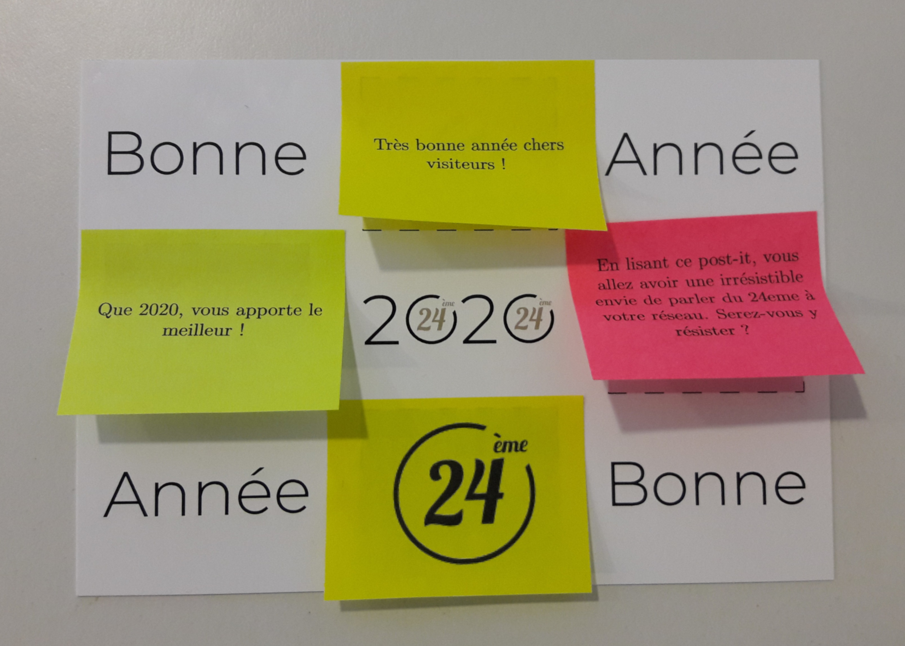

# Voeux 2020

Scripts de génération de textes pouvant s'imprimer sur des post-its de 50x39.

Chaque ligne (ne contentant pas de #) correspond à un post-it.

Pour les imprimer :

1- saisir le fichier messages.txt (une ligne par post-it)
2- ``make postit``
3- ``make``
4- imprimer le fichier ``postits21_trame.pdf``
5- disposez les 21 post-its sur la page imprimée
6- imprimer sur la page contenant les post-its une des pages du fichier ``postits21.pdf``

## Le résultat

